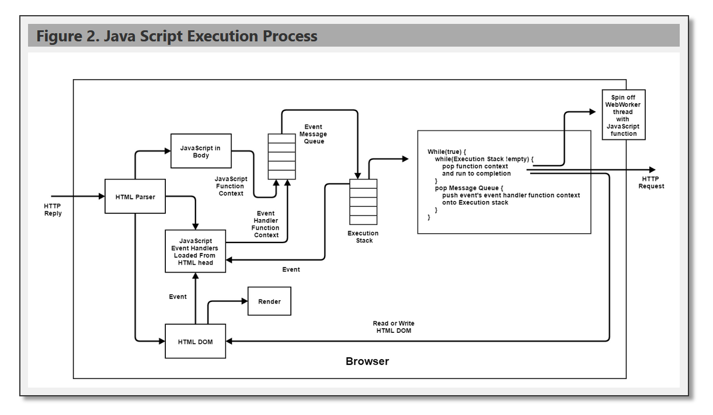

# ViewImageComponent

A W3C custom element (`<view-image>`) that displays a titled, bordered image panel. Users click the image to widen it and click the title bar to narrow it, one step per click. Aspect ratio is always preserved.

## Files

```
ViewImageComponent/
  js/ViewImage.js            component definition
  css/ViewImage.css          host-page placement helpers
  ViewImageComponent.html    demo / test page
  SpecViewImageComponent.md  design specification
```

## Setup

```html
<link rel="stylesheet" href="css/ViewImage.css">
<script src="js/ViewImage.js" defer></script>
```

The containing page should define `--light` and `--dark` CSS custom properties for the default color scheme:

```css
:root {
  --light: #f0f0f0;
  --dark:  #333;
}
```

## Usage



---

```html
<view-image src="pictures/MyPhoto.jpg" alt="Description" width="20rem"
            style="float:right;">
  Figure 1. Caption text here
</view-image>
```

Inline content of the element becomes the title bar text.

## Attributes

| Attribute        | Default        | Description                                   |
|------------------|----------------|-----------------------------------------------|
| `src`            | (none)         | URL of the image                              |
| `alt`            | `""`           | Alt text for the image                        |
| `width`          | `max-content`  | Initial width of the view (any CSS length)    |
| `bg-color`       | `var(--light)` | Background of the view box                    |
| `title-bg-color` | `#aaa`         | Background of the title bar                   |
| `step-px`        | `40`           | Pixels added or removed per width click       |
| `min-width`      | `120`          | Minimum width in pixels when narrowing        |

## Interaction

- **Click image** — widens by `step-px` pixels.
- **Click title bar** — narrows by `step-px` pixels, down to `min-width`.

Width is tracked on the outer view box. The `` fills it at `width: 100%; height: auto`, so aspect ratio is maintained as the panel resizes.

## Inline Style Notes

- `--title-font-size` controls the title bar font size (default `1rem`). Set it on the element: `style="--title-font-size: 1.2rem"`.
